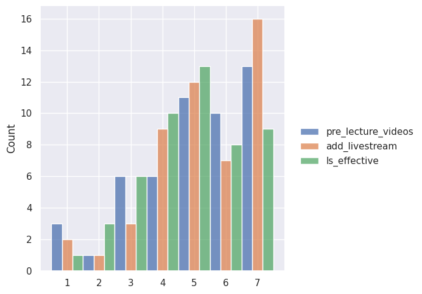
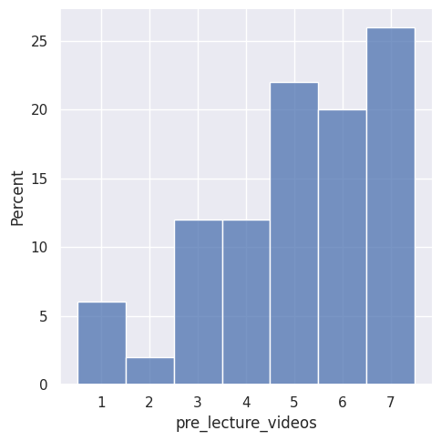
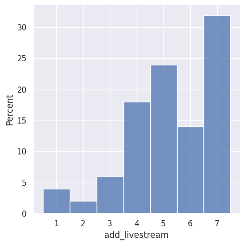
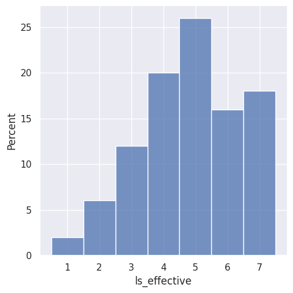

---
# Do not edit the text between these lines!
layout: default
---

# Comp110 EX09 - Data Analysis for Continuous Improvement

## Our proposed improvement
We propose that the course should record/livestream and post the lectures because it will act as a helpful reference or a way to catch up on missed classes for enrolled students.

In order to analyze the data and see if it supported our proposal, we identified three relevant questions from the class survey:
1. I believe that optional pre-lecture videos that prepare students for the content of each lecture would be helpful for my learning
2. I believe in-person lectures should be live streamed so that not everyone is required to attend in-person.
3. Lesson videos are effective in helping me learn the topics of the course.

We chose these questions because we believed they would best tell us how students feel about videos related to coursework, and if they are considered helpful to their learning. Using one table allows us to easily compare the responses to each question and see how they differ.

Students responded by choosing a number between 1 and 7, or "strongly disagree" to "strongly agree". To make the data easier to read, we transformed it into a histogram that plotted the first 50 responses to each statement.

<!-- This is a comment. Below, you'll see code for inserting an image. To make this image appear, update <custom-path>. To add an image, save it inside the imgs folder of this repository. -->

This combined histogram makes it possible for us to compare how students responded to each question, but it's difficult to see the proportion of each response to a single question.

In order to analyze the responses to each individual question, we created three different histograms that plotted the percentage of responses for each number.

This histogram shows us that over a quarter of students strongly agreed with the first statement, "I believe that optional pre-lecture videos that prepare students for the content of each lecture would be helpful for my learning".

For the second statement, over 30% of students strongly agreed that "in-person lectures should be live streamed so that not everyone is required to attend in-person"!

The final histogram shows us that a majority of students agreed with the third statement, "Lesson videos are effective in helping me learn the topics of the course", but more students felt neutral than strongly agreed.

Based on this analysis, we concluded that our analysis does support our idea of recording or livestreaming lectures and posting them to the course website for students to refer to if they need to review or catch up on missed work. The lectures are already recorded, so the only change that would be implemented is adding those recordings to the Comp110 website. Based on the histograms, most students do support the lectures being livestreamed; over 30% of students in our sample responded that they strongly agree with the statement "I believe in-person lectures should be live streamed so that not everyone is required to attend in-person", and only about 12% of students disagreed. The combined distribution plot shows us that, out of all three statements that were considered, students most strongly agreed with this statement. A majority of students also agreed with the statement "I believe that optional pre-lecture videos that prepare students for the content of each lecture would be helpful for my learning", further supporting the idea that students consider video content to be an effective tool for learning class content. 

The responses to the final statement, "Lesson videos are effective in helping me learn the topics of the course", do not support our claim as strongly. While a majority of students do agree with the statement, more students responded neutrally than strongly agree. 

It would not cost anything besides a little extra time on the part of the instructional staff to record and post the lectures as they are already recorded; the link would just have to be added to the course website, similar to how the tutoring sessions are posted. This idea could be explored further by adding timestamps to the recordings so students can find the content they are interested in without having to scrub through the entire video. There could also be a space for students to comment on or ask questions about specific parts of the lecture for the instructor or TAs to respond to in future classes. This would be helpful for students who weren't there to ask questions, or students that don't feel comfortable asking questions in a large lecture hall. A potential trade-off of this proposed change is that it might lead to more students missing class. If there is no threat of missing content, there is little incentive to be physically present. This could have a negative impact on the enrolled students themselves as missing class, even when the content is available online, makes it easier to fall behind.

## Thank you for visiting Simone and River's beautiful project website!